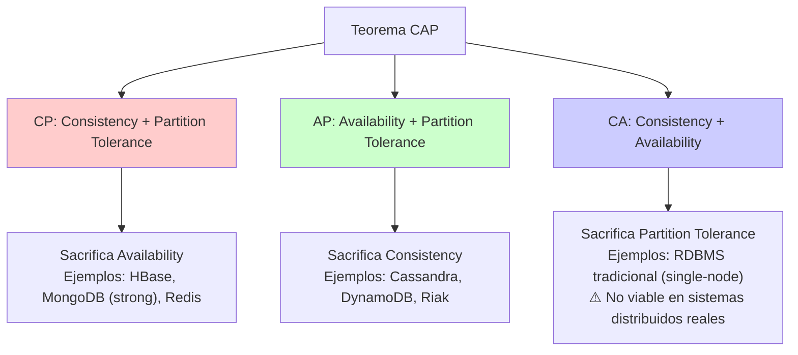
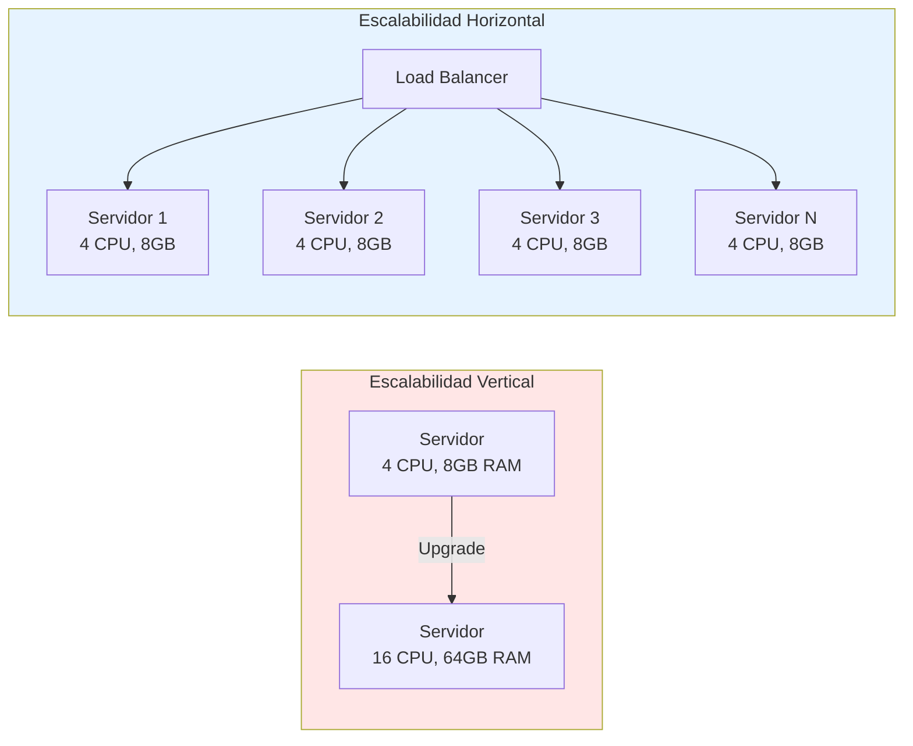
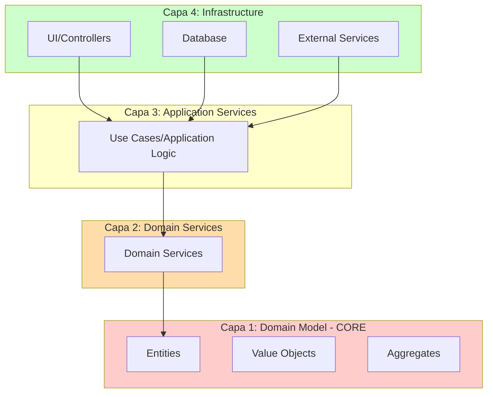
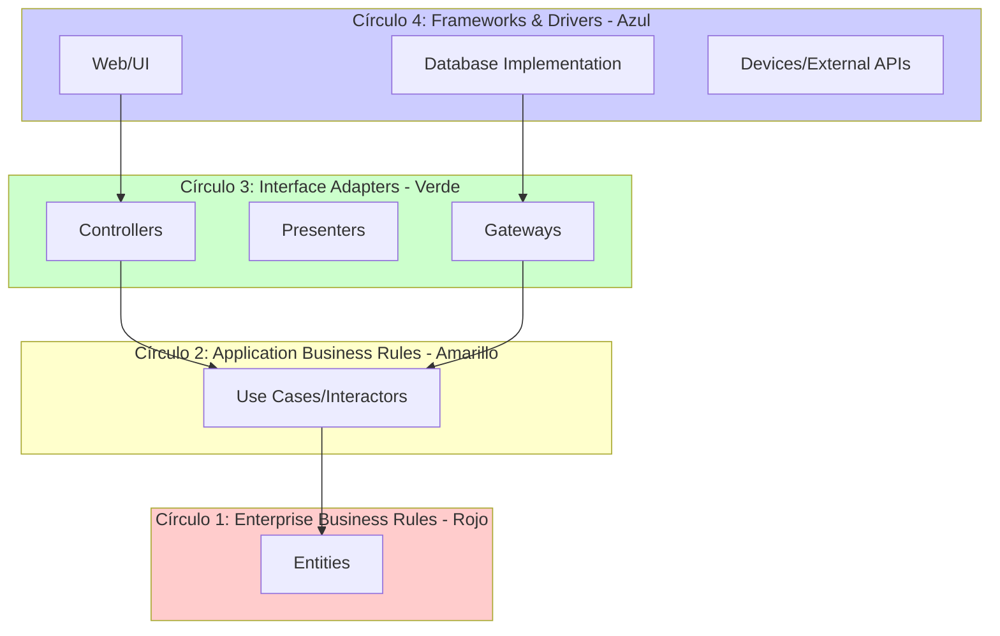
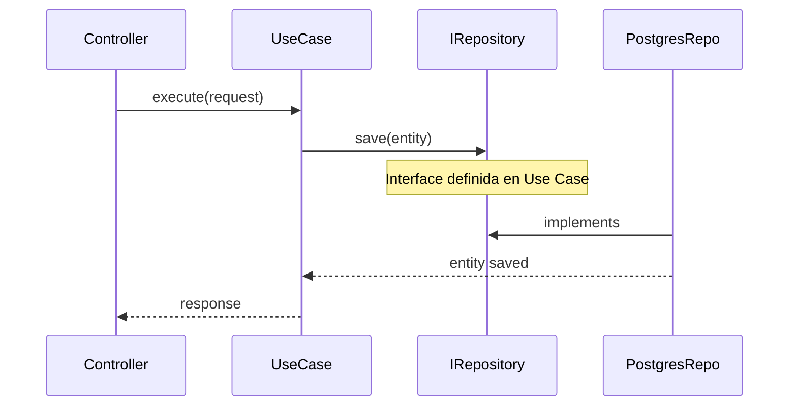
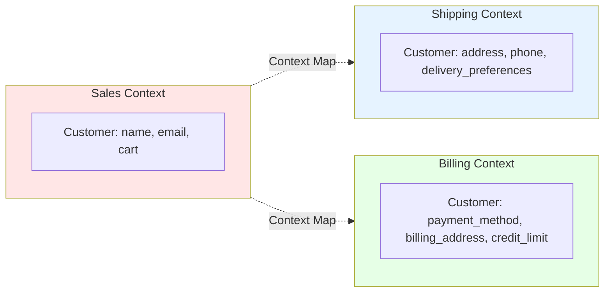

# Arquitectura y Patrones

> Estructuras de alto nivel y soluciones probadas para organizar sistemas complejos, escalables y mantenibles.

---

## 🏗️ Arquitecturas de Software

**Qué:** Decisiones estructurales fundamentales sobre cómo organizar un sistema.

**Por qué:** Define cómo el sistema crece, se mantiene y responde al cambio. Una mala arquitectura puede matar un proyecto exitoso.

**Quién:** Arquitectos de software, tech leads, senior developers.

**Costo:** Decisión temprana de alto impacto. Cambiar arquitectura en sistema maduro = 6-18 meses.

| Arquitectura | Qué | Por qué | Cuándo | Dónde | Cómo | Trade-offs |
| :------------- | :----- | :---- | :----- | :------ | :---- | :----------- |
| **Monolítica** | Aplicación única con todos los módulos integrados | Simplicidad, deployment único, debugging fácil | MVPs, equipos pequeños, dominios simples | Startups, sistemas internos | Todo en un proceso, shared DB, deployment único | ✅ Simple, rápido desarrollo inicial; ✅ Si esta bien estructurado puede escalar horizontalmente duplicando el proceso; ❌ Escalado vertical; ❌ Acoplamiento y la dificultad de escalar componentes específicos de manera independiente |
| **MVC** | Model-View-Controller: separar datos, UI y control | Claridad en responsabilidades | Apps web tradicionales, dashboards | Backend + templates | Modelos (datos), Vistas (UI), Controladores (lógica coordinación) | ✅ Patrón conocido; ❌ Controllers crecen (fat controllers) |
| **Microservicios** | Sistema distribuido con servicios independientes | Escalado independiente, equipos autónomos | Sistemas complejos, múltiples equipos | Netflix, Uber, Amazon | Servicios pequeños, comunicación API/eventos, DB por servicio | ✅ Escalabilidad, fault isolation; ❌ Complejidad operacional, latencia |
| **Hexagonal** | Lógica central aislada de interfaces externas (ports & adapters) | Testability, independencia de frameworks | Dominios complejos, larga vida | Backend crítico | Core (lógica) + Puertos (interfaces) + Adaptadores (implementaciones) | ✅ Testeo fácil, cambiar DB/UI sin tocar core; ❌ Más código inicial |
| **Capas** | Separación horizontal: presentación, negocio, datos | Modularidad, responsabilidades claras | Sistemas empresariales tradicionales | Monolitos estructurados | Capas solo conocen la inferior, DTO entre capas | ✅ Organización clara; ❌ Puede ser rígido |
| **Event-Driven** | Comunicación basada en eventos asincrónicos | Desacoplamiento, escalabilidad | Sistemas con workflows complejos, integraciones | E-commerce, IoT, streaming | Event Bus/Broker, productores/consumidores | ✅ Desacoplamiento total; ❌ Debugging complejo, eventual consistency |
| **Serverless** | Funciones sin servidor dedicado, auto-scaling | Costo por uso, cero gestión servidores | Tareas puntuales, APIs sencillas, jobs | AWS Lambda, Cloud Functions | Funciones stateless, triggers (HTTP, eventos), short-lived | ✅ Escalado automático, low cost; ❌ Cold starts, vendor lock-in |

---

## ⚖️ Teorema CAP

**Qué:** En un sistema distribuido, solo se pueden garantizar simultáneamente **dos de tres** propiedades: **Consistencia** (Consistency), **Disponibilidad** (Availability) y **Tolerancia a Particiones** (Partition Tolerance).

**Por qué:** Es el pilar teórico que justifica las elecciones entre bases de datos SQL y NoSQL, y las arquitecturas distribuidas. Entender CAP permite tomar decisiones informadas sobre trade-offs.

**Quién:** Arquitectos de software, tech leads, desarrolladores de sistemas distribuidos.

**Cuándo:** Al diseñar sistemas distribuidos, elegir bases de datos, definir arquitecturas de microservicios.

### Las Tres Propiedades

| Propiedad | Qué significa | Ejemplo |
| :---------- | :-------------- | :-------- |
| **Consistency (C)** | Todos los nodos ven los mismos datos al mismo tiempo. Lectura siempre retorna el valor más reciente | Sistemas bancarios: saldo debe ser exacto en todas las consultas |
| **Availability (A)** | Toda solicitud recibe una respuesta (éxito o fallo), sin garantía de que contenga el dato más reciente | Redes sociales: mejor mostrar timeline ligeramente desactualizado que error |
| **Partition Tolerance (P)** | El sistema continúa operando a pesar de pérdida de mensajes entre nodos (particiones de red) | Inevitable en sistemas distribuidos (red puede fallar) |

### El Trade-off Fundamental



### Decisiones Prácticas

| Escenario | Elección | Justificación | Tecnología |
| :---------- | :--------- | :-------------- | :----------- |
| **Sistema bancario** | **CP** | Consistencia es crítica, mejor rechazar operación que mostrar saldo incorrecto | PostgreSQL (strong consistency), Spanner |
| **Red social** | **AP** | Disponibilidad es clave, eventual consistency es aceptable | Cassandra, DynamoDB |
| **E-commerce (carrito)** | **AP** | Mejor permitir agregar al carrito aunque inventario esté levemente desactualizado | DynamoDB, Riak |
| **E-commerce (checkout)** | **CP** | Al finalizar compra, inventario debe ser exacto | PostgreSQL con locks, MongoDB transactions |

### Consistencia Eventual

**Qué:** En sistemas **AP**, los datos eventualmente convergen a un estado consistente, pero puede haber ventanas de inconsistencia.

**Ejemplo:** Publicar un tweet puede tardar segundos en aparecer para todos los seguidores (eventual consistency), pero el sistema siempre está disponible.

**Herramientas:** Cassandra, DynamoDB, Riak, CouchDB.

### Recursos CAP

- [CAP Theorem - Martin Kleppmann](https://martin.kleppmann.com/2015/05/11/please-stop-calling-databases-cp-or-ap.html)
- [Brewer's CAP Theorem](https://www.infoq.com/articles/cap-twelve-years-later-how-the-rules-have-changed/)

---

## 📈 Escalabilidad: Vertical vs Horizontal

**Qué:** Estrategias para aumentar la capacidad de un sistema ante mayor carga.

**Por qué:** Entender este trade-off es fundamental para diseñar arquitecturas que crezcan eficientemente. La elección afecta costos, complejidad y límites de crecimiento.

**Quién:** Arquitectos, DevOps, tech leads.

**Cuándo:** Al planificar crecimiento, ante problemas de performance, diseñando nuevos sistemas.

### Comparación

| Aspecto | Escalabilidad Vertical (Scale Up) | Escalabilidad Horizontal (Scale Out) |
| :-------- | :---------------------------------- | :------------------------------------- |
| **Qué es** | Aumentar recursos de un solo servidor (más CPU, RAM, disco) | Añadir más servidores/instancias |
| **Límite** | Físico (máximo hardware disponible) | Prácticamente ilimitado |
| **Costo** | Exponencial (hardware high-end es desproporcionadamente caro) | Lineal (agregar commodity hardware) |
| **Complejidad** | Baja (sin cambios arquitectónicos) | Alta (requiere load balancing, estado distribuido) |
| **Downtime** | Sí (al reemplazar hardware) | No (agregar nodos sin downtime) |
| **Arquitectura** | Favorece **Monolitos** | Favorece **Microservicios**, arquitecturas distribuidas |
| **Ejemplos** | Servidor de 8GB RAM → 32GB RAM | 1 servidor → 10 servidores detrás de load balancer |

### Cuándo Usar Cada Una

| Escenario | Recomendación | Razón |
| :---------- | :-------------- | :------ |
| **MVP, startup temprana** | **Vertical** | Simplicidad, menor overhead operacional |
| **Base de datos SQL (PostgreSQL, MySQL)** | **Vertical primero**, luego read replicas (horizontal) | SQL escala mejor verticalmente, sharding es complejo |
| **Aplicación stateless (API REST)** | **Horizontal** | Fácil replicar, load balancer distribuye |
| **Procesamiento batch** | **Horizontal** | Paralelizar tareas independientes |
| **Cache (Redis)** | **Vertical** hasta límite, luego **Horizontal** (sharding) | Redis es single-threaded, vertical es eficiente |
| **Tráfico impredecible** | **Horizontal con auto-scaling** | Agregar/quitar nodos según demanda |

### Ejemplo Visual



### Relación con Arquitecturas

| Arquitectura | Escalabilidad Natural | Por qué |
| :------------- | :--------------------- | :-------- |
| **Monolito** | **Vertical** | Todo en un proceso, difícil distribuir. Puede escalar horizontalmente si es stateless y usa DB externa |
| **Microservicios** | **Horizontal** | Servicios independientes, fácil replicar cada uno según necesidad |
| **Serverless** | **Horizontal automático** | Provider escala funciones automáticamente |
| **Event-Driven** | **Horizontal** | Consumidores de eventos se pueden replicar |

### Estrategia Híbrida

**Recomendación:** Combinar ambas estrategias según el componente.

**Ejemplo:**

- **API Gateway:** Horizontal (múltiples instancias)
- **Base de datos:** Vertical (servidor potente) + Read Replicas (horizontal para lecturas)
- **Workers de procesamiento:** Horizontal (escalar según cola)
- **Cache (Redis):** Vertical hasta 64GB, luego sharding (horizontal)

### Recursos Escalabilidad

- [Vertical vs Horizontal Scaling - AWS](https://aws.amazon.com/compare/the-difference-between-horizontal-and-vertical-scaling/)
- [Scalability - Martin Fowler](https://martinfowler.com/articles/scaling-architecture.html)

---

## 🔷 Arquitectura Hexagonal (Ports & Adapters)

 **Qué:** Patrón arquitectónico que aísla la lógica de negocio (Core) de los detalles de implementación (UI, DB, Frameworks) mediante Puertos y Adaptadores.

 **Objetivo:** Permitir que la aplicación sea dirigida por usuarios, programas, pruebas automatizadas o scripts por igual, y ser desarrollada y probada aisladamente de sus dispositivos de ejecución y bases de datos.

### Componentes Principales

 1. **Dominio (Core):** Entidades y reglas de negocio puras. No depende de nada externo.
 2. **Aplicación (Use Cases):** Orquesta el flujo de datos desde/hacia el dominio. Define qué hace el sistema.
 3. **Puertos (Interfaces):**
    - **Primarios (Driver):** API pública que expone la aplicación (ej. `IUserService`).
    - **Secundarios (Driven):** Interfaces que la aplicación necesita (ej. `IUserRepository`, `IEmailSender`).
 4. **Adaptadores (Infraestructura):** Implementaciones concretas.
    - **Driver Adapters:** Controladores REST, CLI, GUI.
    - **Driven Adapters:** Repositorio SQL, Cliente SMTP.

### Diagrama de Dependencias

 ```mermaid
 flowchart TD
     subgraph Infrastructure[Capa de Infraestructura]
         Controller[REST Controller]
         DB[SQL Repository]
         Mail[SMTP Service]
     end
 
     subgraph Core[Capa de Dominio & Aplicación]
         UseCase[Use Case Interactor]
         PortIn["Input Port <br> (Interface)"]
         PortOut["Output Port <br> (Interface)"]
         Entity[Domain Entity]
     end
 
     Controller --> PortIn
     PortIn -.-> UseCase
     UseCase --> Entity
     UseCase --> PortOut
     DB -.-> PortOut
     Mail -.-> PortOut
     
     style Infrastructure fill:#f9f,stroke:#333
     style Core fill:#ccf,stroke:#333
 ```

 > **Nota:** Observa cómo las flechas de dependencia cruzan los límites **hacia adentro**. La Infraestructura depende del Core/Puertos, nunca al revés.

### Relación con Screaming Architecture

 La **Screaming Architecture** (ver abajo) es la forma ideal de organizar las carpetas para implementar Arquitectura Hexagonal, agrupando por contexto y segregando la infraestructura.

---

## 🧅 Onion Architecture (Arquitectura de Cebolla)

**Qué:** Arquitectura en capas concéntricas donde las dependencias apuntan hacia el centro. El núcleo contiene el dominio, y las capas externas contienen la infraestructura.

**Por qué:** Garantiza que la lógica de negocio no dependa de detalles técnicos (frameworks, DB, UI). Facilita testing y cambios tecnológicos.

**Quién:** Propuesta por Jeffrey Palermo (2008).

**Cuándo:** Aplicaciones empresariales complejas, sistemas de larga vida, cuando la lógica de negocio es crítica.

### Capas de la Cebolla (de adentro hacia afuera)



| Capa | Responsabilidad | Ejemplos | Depende de |
| :----- | :---------------- | :--------- | :----------- |
| **1. Domain Model (Core)** | Entidades, Value Objects, reglas de negocio puras | `User`, `Order`, `Money` | Nada (independiente) |
| **2. Domain Services** | Lógica de dominio que no pertenece a una entidad | `PricingService`, `InventoryValidator` | Domain Model |
| **3. Application Services** | Casos de uso, orquestación de flujos | `CreateOrderUseCase`, `ProcessPayment` | Domain Services + Domain Model |
| **4. Infrastructure** | Implementaciones técnicas (DB, UI, APIs) | `PostgresOrderRepository`, `ExpressController` | Application Services |

### Regla de Oro: Dependency Rule

> **Las dependencias solo pueden apuntar hacia adentro. Las capas internas NO conocen las externas.**

**Ejemplo:**

- ✅ `Infrastructure` → `Application Services` → `Domain Model`
- ❌ `Domain Model` NO puede depender de `Infrastructure`

### Comparación con Hexagonal

| Aspecto | Hexagonal | Onion |
| :-------- | :---------- | :------ |
| **Concepto clave** | Puertos y Adaptadores | Capas concéntricas |
| **Dependencias** | Hacia el Core | Hacia el centro |
| **Organización** | Horizontal (Ports/Adapters) | Vertical (Capas) |
| **Similitud** | Ambas aíslan el dominio de la infraestructura | Ambas aíslan el dominio de la infraestructura |

### Ejemplo de Código

#### Capa 1: Domain Model

```typescript
// domain/entities/Order.ts
export class Order {
  constructor(
    public readonly id: string,
    public readonly items: OrderItem[],
    public status: OrderStatus
  ) {}

  calculateTotal(): Money {
    return this.items.reduce((sum, item) => sum.add(item.price), Money.zero());
  }

  canBeCancelled(): boolean {
    return this.status === OrderStatus.Pending;
  }
}
```

#### Capa 3: Application Service

```typescript
// application/use-cases/CreateOrder.ts
export class CreateOrderUseCase {
  constructor(
    private orderRepository: IOrderRepository, // Puerto (interface)
    private pricingService: PricingService
  ) {}

  async execute(request: CreateOrderRequest): Promise<Order> {
    const order = new Order(uuid(), request.items, OrderStatus.Pending);
    const total = this.pricingService.calculateWithTax(order);
    await this.orderRepository.save(order);
    return order;
  }
}
```

#### Capa 4: Infrastructure

```typescript
// infrastructure/repositories/PostgresOrderRepository.ts
export class PostgresOrderRepository implements IOrderRepository {
  async save(order: Order): Promise<void> {
    await db.query('INSERT INTO orders ...', order);
  }
}
```

### Cuándo Usar Onion Architecture

- ✅ **Lógica de negocio compleja**: Fintech, healthcare, e-commerce
- ✅ **Sistemas de larga vida**: Proyectos que evolucionarán años
- ✅ **Testing crítico**: Necesitas testear dominio sin infraestructura
- ⚠️ **MVPs simples**: Puede ser over-engineering
- ❌ **CRUD básicos**: Capas tradicionales pueden ser suficientes

---

## 🏛️ Clean Architecture

**Qué:** Arquitectura propuesta por Robert C. Martin (Uncle Bob) que combina principios de Hexagonal, Onion y otras arquitecturas para crear sistemas independientes de frameworks, UI, DB y agentes externos.

**Por qué:** Maximiza la independencia del dominio, facilita testing, permite cambiar tecnologías sin afectar la lógica de negocio.

**Cuándo:** Sistemas empresariales complejos, aplicaciones de larga vida, cuando la lógica de negocio es el activo más valioso.

### Los 4 Círculos de Clean Architecture



| Círculo | Nombre | Responsabilidad | Ejemplos |
| :-------- | :------- | :---------------- | :--------- |
| **1 (Centro)** | **Enterprise Business Rules** | Entidades de negocio, reglas críticas | `User`, `Order`, `Invoice` |
| **2** | **Application Business Rules** | Casos de uso específicos de la aplicación | `CreateUser`, `PlaceOrder`, `GenerateReport` |
| **3** | **Interface Adapters** | Convertir datos entre casos de uso y frameworks | `UserController`, `OrderPresenter`, `DatabaseGateway` |
| **4 (Exterior)** | **Frameworks & Drivers** | Frameworks, DB, UI, dispositivos | Express, React, PostgreSQL, AWS SDK |

### The Dependency Rule (Regla de Dependencia)

> **El código fuente solo puede apuntar hacia adentro. Nada en un círculo interno puede saber sobre algo en un círculo externo.**

**Implicaciones:**

- ✅ Entities no conocen Use Cases
- ✅ Use Cases no conocen Controllers
- ✅ Use Cases definen **interfaces** (puertos), Infrastructure las implementa
- ❌ Entities NO pueden importar frameworks
- ❌ Use Cases NO pueden importar Express/React

### Flujo de Control vs Flujo de Dependencias

**Problema:** El Controller (externo) necesita llamar al Use Case (interno), pero el Use Case no puede depender del Controller.

**Solución:** Dependency Inversion Principle (DIP)



**Código:**

```typescript
// Circle 2: Use Case define la interface (Puerto)
export interface IUserRepository {
  save(user: User): Promise<void>;
}

export class CreateUserUseCase {
  constructor(private userRepo: IUserRepository) {} // Depende de abstracción
  
  async execute(request: CreateUserRequest): Promise<User> {
    const user = new User(request.name, request.email);
    await this.userRepo.save(user);
    return user;
  }
}

// Circle 4: Infrastructure implementa la interface
export class PostgresUserRepository implements IUserRepository {
  async save(user: User): Promise<void> {
    await db.query('INSERT INTO users ...', user);
  }
}
```

### Comparación: Clean vs Hexagonal vs Onion

| Aspecto | Clean Architecture | Hexagonal | Onion |
| :-------- | :------------------- | :---------- | :------ |
| **Autor** | Robert C. Martin | Alistair Cockburn | Jeffrey Palermo |
| **Concepto clave** | 4 círculos concéntricos | Puertos y Adaptadores | Capas concéntricas |
| **Foco principal** | Independencia total del dominio | Testability y flexibilidad | Separación por capas |
| **Similitud** | Todas aíslan el dominio de la infraestructura y aplican Dependency Inversion | Todas aíslan el dominio de la infraestructura y aplican Dependency Inversion | Todas aíslan el dominio de la infraestructura y aplican Dependency Inversion |

### Ejemplo Completo: Sistema de Pedidos

#### Circle 1: Entity

```typescript
// entities/Order.ts
export class Order {
  constructor(
    public id: string,
    public customerId: string,
    public items: OrderItem[],
    public status: OrderStatus
  ) {}

  calculateTotal(): number {
    return this.items.reduce((sum, item) => sum + item.price * item.quantity, 0);
  }
}
```

#### Circle 2: Use Case + Interface

```typescript
// use-cases/CreateOrder.ts
export interface IOrderRepository {
  save(order: Order): Promise<void>;
}

export interface IEmailService {
  sendOrderConfirmation(order: Order): Promise<void>;
}

export class CreateOrderUseCase {
  constructor(
    private orderRepo: IOrderRepository,
    private emailService: IEmailService
  ) {}

  async execute(request: CreateOrderRequest): Promise<Order> {
    const order = new Order(uuid(), request.customerId, request.items, OrderStatus.Pending);
    await this.orderRepo.save(order);
    await this.emailService.sendOrderConfirmation(order);
    return order;
  }
}
```

#### Circle 3: Controller (Adapter)

```typescript
// adapters/controllers/OrderController.ts
export class OrderController {
  constructor(private createOrderUseCase: CreateOrderUseCase) {}

  async create(req: Request, res: Response) {
    const request = new CreateOrderRequest(req.body.customerId, req.body.items);
    const order = await this.createOrderUseCase.execute(request);
    res.json({ orderId: order.id });
  }
}
```

#### Circle 4: Infrastructure

```typescript
// infrastructure/PostgresOrderRepository.ts
export class PostgresOrderRepository implements IOrderRepository {
  async save(order: Order): Promise<void> {
    await db.query('INSERT INTO orders (id, customer_id, status) VALUES ($1, $2, $3)', 
      [order.id, order.customerId, order.status]);
  }
}

// infrastructure/SendGridEmailService.ts
export class SendGridEmailService implements IEmailService {
  async sendOrderConfirmation(order: Order): Promise<void> {
    await sendgrid.send({ to: order.customerId, template: 'order-confirmation' });
  }
}
```

### Beneficios de Clean Architecture

| Beneficio | Explicación |
| :---------- | :------------ |
| **Independencia de Frameworks** | Cambiar de Express a Fastify no afecta Use Cases |
| **Testability** | Testear Use Cases sin DB/UI (mocks de interfaces) |
| **Independencia de UI** | Misma lógica para Web, Mobile, CLI |
| **Independencia de DB** | Cambiar de PostgreSQL a MongoDB sin tocar dominio |
| **Independencia de Agentes Externos** | APIs de terceros son detalles reemplazables |

### Cuándo Usar Clean Architecture

- ✅ **Sistemas críticos de negocio**: Fintech, healthcare, legal
- ✅ **Proyectos de larga vida**: 5+ años de evolución
- ✅ **Equipos grandes**: Múltiples devs trabajando en paralelo
- ✅ **Alta cobertura de tests**: Testing es prioritario
- ⚠️ **MVPs rápidos**: Puede ralentizar desarrollo inicial
- ❌ **Prototipos desechables**: Over-engineering

---

## 🎯 Domain-Driven Design (DDD)

**Qué:** Enfoque de diseño de software que pone el **dominio del negocio** en el centro del desarrollo, usando un lenguaje ubicuo (Ubiquitous Language) compartido entre técnicos y expertos del dominio.

**Por qué:** Sistemas complejos requieren que el código refleje fielmente el negocio. DDD provee patrones tácticos y estratégicos para modelar dominios complejos.

**Quién:** Propuesto por Eric Evans en su libro "Domain-Driven Design" (2003).

**Cuándo:** Dominios complejos (fintech, healthcare, logística), sistemas empresariales de larga vida.

### Conceptos Estratégicos (Strategic Design)

#### 1. Ubiquitous Language (Lenguaje Ubicuo)

**Qué:** Vocabulario compartido entre desarrolladores y expertos del dominio, usado en código, documentación y conversaciones.

**Por qué:** Elimina ambigüedades, el código se vuelve auto-documentado.

**Ejemplo:**

- ❌ **Mal:** `processData()`, `handleRequest()`, `doStuff()`
- ✅ **Bien:** `approveInsuranceClaim()`, `calculatePremium()`, `issuePolicy()`

#### 2. Bounded Context (Contexto Delimitado)

**Qué:** Límite explícito dentro del cual un modelo de dominio es válido. Diferentes contextos pueden tener modelos diferentes para el mismo concepto.

**Por qué:** Evita que un modelo único intente representar todo (God Model). Permite que equipos trabajen independientemente.

#### Ejemplo: E-commerce



**Nota:** `Customer` significa cosas diferentes en cada contexto. No intentar unificar en un solo modelo.

#### 3. Context Map (Mapa de Contextos)

**Qué:** Diagrama que muestra cómo se relacionan los Bounded Contexts.

**Patrones de integración:**

| Patrón | Qué | Cuándo |
| :------- | :---- | :------- |
| **Shared Kernel** | Contextos comparten un subconjunto del modelo | Equipos muy coordinados, bajo acoplamiento aceptable |
| **Customer/Supplier** | Un contexto (Supplier) provee datos al otro (Customer) | Relación upstream/downstream clara |
| **Conformist** | Customer acepta modelo del Supplier sin traducción | Supplier no puede cambiar (legacy, third-party) |
| **Anti-Corruption Layer (ACL)** | Traducir modelo externo al propio | Proteger dominio de modelos legacy/externos |
| **Published Language** | Formato estándar de intercambio (JSON, XML) | Integración entre contextos independientes |

### Conceptos Tácticos (Tactical Design)

#### 1. Entity (Entidad)

**Qué:** Objeto con identidad única que persiste en el tiempo, aunque sus atributos cambien.

**Ejemplo:**

```typescript
export class User {
  constructor(
    public readonly id: UserId, // Identidad única
    public name: string,
    public email: Email
  ) {}

  changeName(newName: string): void {
    this.name = newName; // Atributos cambian, identidad no
  }
}
```

#### 2. Value Object

**Qué:** Objeto inmutable sin identidad, definido solo por sus atributos. Dos Value Objects con mismos valores son iguales.

**Ejemplo:**

```typescript
export class Money {
  constructor(
    public readonly amount: number,
    public readonly currency: string
  ) {}

  add(other: Money): Money {
    if (this.currency !== other.currency) throw new Error('Currency mismatch');
    return new Money(this.amount + other.amount, this.currency);
  }

  equals(other: Money): boolean {
    return this.amount === other.amount && this.currency === other.currency;
  }
}
```

**Características:**

- ✅ Inmutable
- ✅ Sin identidad (comparación por valor)
- ✅ Encapsula validación (`Email`, `PhoneNumber`, `Money`)

#### 3. Aggregate (Agregado)

**Qué:** Cluster de Entities y Value Objects tratados como una unidad. Tiene un **Aggregate Root** (entidad raíz) que es el único punto de acceso.

**Por qué:** Garantiza consistencia, simplifica transacciones.

#### Ejemplo: Order Aggregate

```typescript
export class Order { // Aggregate Root
  constructor(
    public readonly id: OrderId,
    private items: OrderItem[], // Entities internas
    public status: OrderStatus
  ) {}

  addItem(product: Product, quantity: number): void {
    // Lógica de negocio: validar stock, calcular precio
    this.items.push(new OrderItem(product, quantity));
  }

  // Solo Order puede modificar OrderItems
  removeItem(itemId: string): void {
    this.items = this.items.filter(item => item.id !== itemId);
  }

  calculateTotal(): Money {
    return this.items.reduce((sum, item) => sum.add(item.price), Money.zero());
  }
}

// OrderItem NO se expone directamente, solo a través de Order
class OrderItem {
  constructor(
    public readonly id: string,
    public product: Product,
    public quantity: number
  ) {}
}
```

**Reglas:**

- ✅ Modificaciones solo a través del Aggregate Root
- ✅ Transacciones no cruzan límites de Aggregates
- ✅ Referencias externas solo al Root (por ID)

#### 4. Repository

**Qué:** Abstracción para acceder a Aggregates, simula una colección en memoria.

**Por qué:** Desacopla dominio de la persistencia.

**Ejemplo:**

```typescript
export interface IOrderRepository {
  findById(id: OrderId): Promise<Order | null>;
  save(order: Order): Promise<void>;
  delete(order: Order): Promise<void>;
}

// Uso en Use Case
export class PlaceOrderUseCase {
  constructor(private orderRepo: IOrderRepository) {}

  async execute(request: PlaceOrderRequest): Promise<void> {
    const order = new Order(uuid(), request.items, OrderStatus.Pending);
    await this.orderRepo.save(order); // Abstracción, no SQL directo
  }
}
```

#### 5. Domain Service

**Qué:** Lógica de dominio que no pertenece a una Entity o Value Object específico.

**Cuándo:** Operaciones que involucran múltiples Aggregates o cálculos complejos.

**Ejemplo:**

```typescript
export class PricingService {
  calculateWithTax(order: Order, customer: Customer): Money {
    const subtotal = order.calculateTotal();
    const taxRate = customer.country === 'AR' ? 0.21 : 0.15;
    return subtotal.multiply(1 + taxRate);
  }
}
```

#### 6. Domain Event

**Qué:** Evento que representa algo significativo que ocurrió en el dominio.

**Por qué:** Desacopla reacciones (enviar email, actualizar inventario) de la acción principal.

**Ejemplo:**

```typescript
export class OrderPlacedEvent {
  constructor(
    public readonly orderId: string,
    public readonly customerId: string,
    public readonly total: Money,
    public readonly occurredAt: Date
  ) {}
}

// En el Aggregate
export class Order {
  place(): void {
    this.status = OrderStatus.Placed;
    this.events.push(new OrderPlacedEvent(this.id, this.customerId, this.calculateTotal(), new Date()));
  }
}

// Event Handler
export class SendOrderConfirmationHandler {
  handle(event: OrderPlacedEvent): void {
    emailService.send(event.customerId, 'Order Confirmation', event.orderId);
  }
}
```

### Estructura de Carpetas DDD

```text
/src
  /sales (Bounded Context)
    /domain
      /entities
        - Order.ts
        - Customer.ts
      /value-objects
        - Money.ts
        - Email.ts
      /aggregates
        - OrderAggregate.ts
      /repositories (interfaces)
        - IOrderRepository.ts
      /services
        - PricingService.ts
      /events
        - OrderPlacedEvent.ts
    /application
      /use-cases
        - PlaceOrder.ts
        - CancelOrder.ts
    /infrastructure
      /repositories
        - PostgresOrderRepository.ts
      /controllers
        - OrderController.ts
  /shipping (Bounded Context)
    /domain
      ...
```

### DDD + Clean Architecture

**DDD** (qué modelar) se combina perfectamente con **Clean Architecture** (cómo estructurar):

| DDD | Clean Architecture |
| :---- | :------------------- |
| Entities, Value Objects, Aggregates | Circle 1: Enterprise Business Rules |
| Domain Services | Circle 2: Application Business Rules |
| Repositories (interfaces) | Circle 2: Use Cases definen puertos |
| Repositories (implementaciones) | Circle 4: Infrastructure |

### Cuándo Usar DDD

- ✅ **Dominio complejo**: Fintech, healthcare, seguros, logística
- ✅ **Larga vida del proyecto**: 5+ años
- ✅ **Expertos del dominio disponibles**: Para definir Ubiquitous Language
- ✅ **Múltiples Bounded Contexts**: E-commerce (sales, shipping, billing)
- ⚠️ **CRUD simples**: Over-engineering
- ❌ **Prototipos rápidos**: Demasiada ceremonia inicial

### Recursos DDD

- [Domain-Driven Design - Eric Evans](https://www.amazon.com/Domain-Driven-Design-Tackling-Complexity-Software/dp/0321125215)
- [Implementing Domain-Driven Design - Vaughn Vernon](https://www.amazon.com/Implementing-Domain-Driven-Design-Vaughn-Vernon/dp/0321834577)
- [DDD Reference - Eric Evans (PDF gratuito)](https://www.domainlanguage.com/ddd/reference/)

---

## 📢 Screaming Architecture

**Qué:** Arquitectura que hace obvio el dominio/propósito de la aplicación desde la estructura de carpetas y nombres, no el framework usado.

**Por qué:** Cuando mirás la estructura del proyecto, debería "gritar" qué hace la aplicación (ej: healthcare, e-commerce), no qué framework usa (ej: Rails, Angular).

**Quién:** Acuñado por Robert C. Martin (Uncle Bob)

**Cuándo:** Todos los proyectos, especialmente aplicaciones domain-driven

**Cómo:**

- Carpetas de nivel superior representan dominios de negocio, no capas técnicas
- El framework es un detalle, aislado en capa de infraestructura
- Los casos de uso son explícitos y visibles en la estructura

### Ejemplo - Sistema de Salud

**✅ Screaming Architecture (Grita "Healthcare"):**

```text
/src
  /patients
    /use-cases
      - RegisterPatient.ts
      - ScheduleAppointment.ts
      - UpdateMedicalHistory.ts
    /entities
      - Patient.ts
      - MedicalRecord.ts
    /repositories
      - IPatientRepository.ts
  /appointments
    /use-cases
      - BookAppointment.ts
      - CancelAppointment.ts
    /entities
      - Appointment.ts
  /billing
    /use-cases
      - GenerateInvoice.ts
      - ProcessPayment.ts
  /infrastructure  # Framework vive acá
    /express
    /database
    /email
```

**❌ Framework-Centric (Grita "Express/MVC"):**

```text
/src
  /controllers
    - PatientController.ts
    - AppointmentController.ts
  /services
    - PatientService.ts
    - AppointmentService.ts
  /models
    - Patient.ts
    - Appointment.ts
  /views
  /routes
```

### Principio Clave

> "Your architecture should tell readers about the system, not about the frameworks you used in your system."
> — Robert C. Martin

### Beneficios

| Beneficio | Explicación |
| :---------- | :------------ |
| **Claridad de dominio** | Nuevos devs entienden el negocio mirando carpetas |
| **Independencia de framework** | Cambiar de Express a Fastify no afecta estructura core |
| **Testability** | Casos de uso son testables sin framework |
| **Mantenibilidad** | Features relacionadas están juntas, no dispersas por capas |
| **Onboarding rápido** | La estructura documenta el sistema |

### Cuándo Aplicar

- ✅ **Aplicaciones de negocio complejas**: E-commerce, healthcare, fintech
- ✅ **Proyectos de larga vida**: Sistemas que evolucionarán años
- ✅ **Equipos grandes**: Múltiples devs trabajando en paralelo
- ⚠️ **MVPs simples**: Puede ser over-engineering para prototipos
- ⚠️ **CRUD básicos**: Si solo es ABM, capas tradicionales pueden bastar

---

## 🧩 Patrones de Diseño (Gang of Four)

**Qué:** Soluciones reutilizables a problemas recurrentes de diseño OOP.

**Por qué:** No reinventar la rueda, vocabulario común entre developers.

[Ver todos los patrones explicados en Refactoring Guru](https://refactoring.guru/design-patterns)

### Patrones Creacionales

| Patrón | Qué | Por qué | Cuándo | Cómo |
| :------- | :----- | :---- | :----- | :---- |
| **Factory Method** | Crea objetos sin especificar clase exacta | Delegar creación a subclases | Crear objetos de familias similares | Interface `create()`, subclases deciden tipo concreto |
| **Abstract Factory** | Crea familias de objetos relacionados | Consistencia entre productos | UI con temas (Dark/Light) | Factory retorna conjunto de objetos relacionados |
| **Builder** | Construye objetos complejos paso a paso | Muchas opciones de configuración | DTOs complejos, requests HTTP | `builder.setName().setAge().build()` |
| **Prototype** | Clona objetos existentes | Creación costosa, muchas variaciones | Clonar configuraciones, templates | Implementar `clone()`, copiar estado |
| **Singleton** | Garantiza única instancia global | Un punto de acceso (config, logger) | Recursos compartidos únicos | Constructor privado, `getInstance()` estática |

### Patrones Estructurales

| Patrón | Qué | Por qué | Cuándo | Cómo |
| :------- | :----- | :---- | :----- | :---- |
| **Adapter** | Convierte interfaz incompatible | Integrar código legacy/third-party | Librerías externas con APIs distintas | Wrapper que traduce llamadas |
| **Bridge** | Separa abstracción de implementación | Variar ambas independientemente | UI multiplataforma (misma lógica, distinto render) | Abstracción tiene referencia a implementación |
| **Composite** | Composición jerárquica (árbol) | Tratar individual y compuesto igual | Menús, file systems, org charts | Interface común, contenedor tiene lista de hijos |
| **Decorator** | Añade funcionalidades dinámicamente | Extender sin modificar clase | Logging, caching, autenticación en requests | Wrapper que implementa misma interface |
| **Facade** | Interfaz simplificada a subsistema complejo | Ocultar complejidad interna | APIs complejas (AWS SDK → helper simple) | Clase que expone métodos high-level |
| **Flyweight** | Minimiza memoria compartiendo datos | Muchos objetos similares | Renderizar 10k íconos (compartir imagen) | Separar estado intrínseco (compartido) de extrínseco |
| **Proxy** | Controla acceso a objeto | Lazy loading, caching, seguridad | Imágenes pesadas, permisos | Proxy implementa misma interface, delega a real |

### Patrones Comportamiento

| Patrón | Qué | Por qué | Cuándo | Cómo |
| :------- | :----- | :---- | :----- | :---- |
| **Strategy** | Familia de algoritmos intercambiables | Cambiar comportamiento en runtime | Ordenamiento (bubble, quick, merge) | Interface `execute()`, contexto recibe estrategia |
| **Observer** | Notifica cambios a múltiples objetos | Reacción automática ante eventos | UI reactiva (state → re-render) | Sujeto tiene lista de observadores, `notify()` |
| **Command** | Encapsula solicitud como objeto | Parametrizar, deshacer, encolar | Undo/Redo, job queues | Interface `execute()`, receiver realiza acción |
| **State** | Cambia comportamiento según estado interno | Manejar estados complejos | Workflows (draft→review→published) | Context delega a objeto State actual |
| **Template Method** | Esqueleto de algoritmo, pasos personalizables | Reutilizar estructura | Conectar a DB (común: connect, query, close) | Clase abstracta define pasos, subclases implementan |
| **Chain of Responsibility** | Pasa solicitud por cadena de manejadores | Procesamiento flexible | Middleware (auth → logging → handler) | Cada handler procesa o pasa al siguiente |
| **Visitor** | Añade operaciones sin modificar clases | Operaciones sobre estructura compleja | Export (HTML, PDF, JSON) de mismo árbol | Interface `visit()`, elementos aceptan visitor |
| **Mediator** | Centraliza comunicación entre objetos | Reducir acoplamiento | UI forms (campos se habilitan según otros) | Componentes se comunican vía mediador |
| **Memento** | Guarda y restaura estado | Undo/Redo, snapshots | Editores, juegos | Originator crea memento, caretaker lo guarda |
| **Iterator** | Recorre elementos sin exponer estructura | Acceso secuencial estándar | Colecciones custom | Interface `next()`, `hasNext()` |

---

## 🏗️ Patrones Arquitectónicos Avanzados

| Patrón | Qué | Por qué | Cuándo | Dónde | Cómo | Herramientas |
| :------- | :----- | :---- | :----- | :------ | :---- | :------------- |
| **Event Sourcing** | Persistir cambios como secuencia de eventos inmutables | Auditoría completa, time travel, proyecciones | Sistemas financieros, compliance | Event Store | Cada cambio → evento (`OrderPlaced`), reconstruir estado reproduciendo | [EventStore](https://www.eventstore.com/), [Kafka](https://kafka.apache.org/) |
| **CQRS** | Separar modelos de lectura (Query) y escritura (Command) | Optimizar cada uno independientemente | Escrituras complejas + lecturas frecuentes | APIs de alta carga | Commands modifican, Queries leen vistas desnormalizadas | [MediatR](https://github.com/jbogard/MediatR), [Axon](https://axoniq.io/) |
| **Saga Pattern** | Transacciones distribuidas con compensación | Consistencia eventual entre microservicios | Workflows multi-servicio (order→payment→shipping) | Microservicios | Orquestada (coordinador) o Coreografiada (eventos) | [Temporal](https://temporal.io/), [Camunda](https://camunda.com/) |
| **Circuit Breaker** | Prevenir cascadas de fallos | Sistema resiliente ante servicios caídos | Llamadas a APIs externas inestables | Clientes HTTP | Closed→Open (tras N fallos)→Half-Open (test)→Closed | [Resilience4j](https://resilience4j.readme.io/), [Hystrix](https://github.com/Netflix/Hystrix) |
| **Strangler Fig** | Migrar legacy gradualmente | Reemplazo sin big bang | Modernizar monolito → microservicios | Proxy/Gateway | Nuevo código intercepta requests, delega a legacy o nuevo | [nginx](https://nginx.org/), [Envoy](https://www.envoyproxy.io/) |
| **API Gateway** | Punto de entrada único para múltiples servicios | Routing, auth, rate limiting centralizado | Microservicios con necesidades cross-cutting | Edge de la red | Gateway maneja auth, transforma requests, agrega respuestas | [Kong](https://konghq.com/), [AWS API Gateway](https://aws.amazon.com/api-gateway/) |
| **Bulkhead Pattern** | Aislar recursos para prevenir fallo total | Un servicio lento no consume todo | Pools de conexiones, threads | Thread pools, circuit breakers | Separar pools por tipo de operación | [Resilience4j Bulkhead](https://resilience4j.readme.io/docs/bulkhead) |

---

## 🎭 Finite State Machines (FSM)

**Qué:** Modelar sistemas con estados finitos y transiciones explícitas.

**Por qué:** Elimina bugs de estados inválidos, documentación visual ejecutable.

**Cuándo:** Workflows complejos (pedidos, aprobaciones, onboarding), procesos con múltiples actores.

| Concepto | Qué | Ejemplo |
| :--------- | :----- | :-------- |
| **Estados** | Conjunto finito de condiciones | `Pending`, `Paid`, `Shipped`, `Delivered`, `Cancelled` |
| **Transiciones** | Cambios entre estados con condiciones | `Pending → Paid` (al recibir pago) |
| **Eventos** | Triggers que activan transiciones | `PaymentReceived`, `ShipmentDispatched` |
| **Guards** | Condiciones para permitir transición | `Paid → Shipped` solo si `inventory > 0 && address_valid` |
| **Acciones** | Side effects al entrar/salir | Al entrar en `Paid`: enviar email, decrementar stock |

**Herramientas:** [XState](https://xstate.js.org/), [Spring State Machine](https://spring.io/projects/spring-statemachine), [Python transitions](https://github.com/pytransitions/transitions)

**Ejemplo XState:**

```typescript
import { createMachine } from 'xstate';

const orderMachine = createMachine({
  id: 'order',
  initial: 'pending',
  states: {
    pending: {
      on: { PAYMENT_RECEIVED: 'paid' }
    },
    paid: {
      on: { 
        SHIP: { 
          target: 'shipped', 
          cond: 'hasInventory' 
        }
      },
      entry: 'sendConfirmationEmail'
    },
    shipped: {
      on: { DELIVER: 'delivered' }
    },
    delivered: { type: 'final' }
  }
});
```

---

## 📐 Principios de Arquitectura

> **Nota:** Estos principios se aplican a nivel arquitectónico. Para ver su definición fundamental y aplicación a nivel de código, consultar [Reglas Generales de Código](./fundamentos.md#reglas-generales-de-codigo).

| Principio | Qué | Por qué |
| :---------- | :----- | :---- |
| **Separation of Concerns** | Separar responsabilidades en módulos/capas | Mantenimiento, testing, escalabilidad |
| **Single Responsibility** | Cada módulo/clase tiene una razón para cambiar | Cohesión alta, bajo acoplamiento |
| **Dependency Inversion** | Depender de abstracciones, no concreciones | Testability, flexibilidad |
| **Open/Closed** | Abierto a extensión, cerrado a modificación | Agregar features sin romper existente |
| **Least Knowledge** | Módulos conocen lo mínimo necesario | Reduce fragilidad |

---

## 🗂️ Distribución de Carpetas

| Enfoque | Qué | Cuándo | Ejemplo |
| :-------- | :----- | :----- | :-------- |
| **Por tipo** | Separar por categoría técnica | Proyectos pequeños | `/controllers`, `/services`, `/models` |
| **Por feature** | Agrupar por funcionalidad | Proyectos medianos/grandes | `/auth`, `/dashboard`, `/billing` |
| **Por dominio** | Agrupar por contexto de negocio | DDD | `/sales`, `/inventory`, `/shipping` |
| **Monorepo modular** | Múltiples apps/packages en un repo | Microservicios, libs compartidas | `/apps/web`, `/apps/api`, `/packages/ui` |

---

## 🚫 Anti-patrones Arquitectónicos

| Anti-patrón | Problema | Solución |
| :------------ | :--------- | :--------- |
| **Big Ball of Mud** | Sin estructura clara, todo acoplado | Refactorizar incremental, definir módulos |
| **God Object** | Una clase hace todo | Aplicar SRP, extraer responsabilidades |
| **Spaghetti Code** | Flujo imposible de seguir | Linealizar, extraer funciones, FSM |
| **Golden Hammer** | Usar misma solución para todo | Evaluar trade-offs por caso |
| **Premature Generalization** | Abstracciones sin casos de uso reales | Esperar 3 casos antes de generalizar |

---

## 📚 Recursos

- [Refactoring Guru - Patrones](https://refactoring.guru/design-patterns)
- [Software Architecture Patterns - O'Reilly](https://www.oreilly.com/library/view/software-architecture-patterns/9781491971437/)
- [Building Microservices - Sam Newman](https://samnewman.io/books/building_microservices_2nd_edition/)
- [Clean Architecture - Robert Martin](https://www.amazon.com/Clean-Architecture-Craftsmans-Software-Structure/dp/0134494164)
